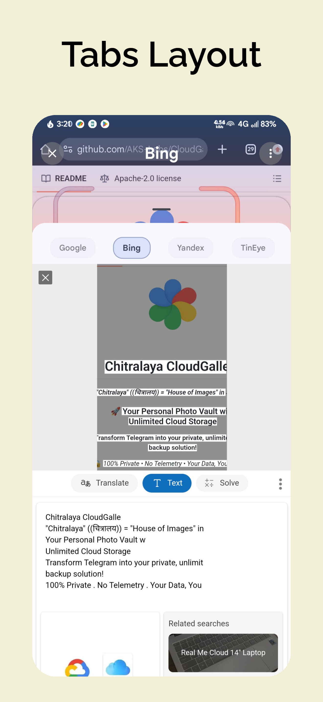
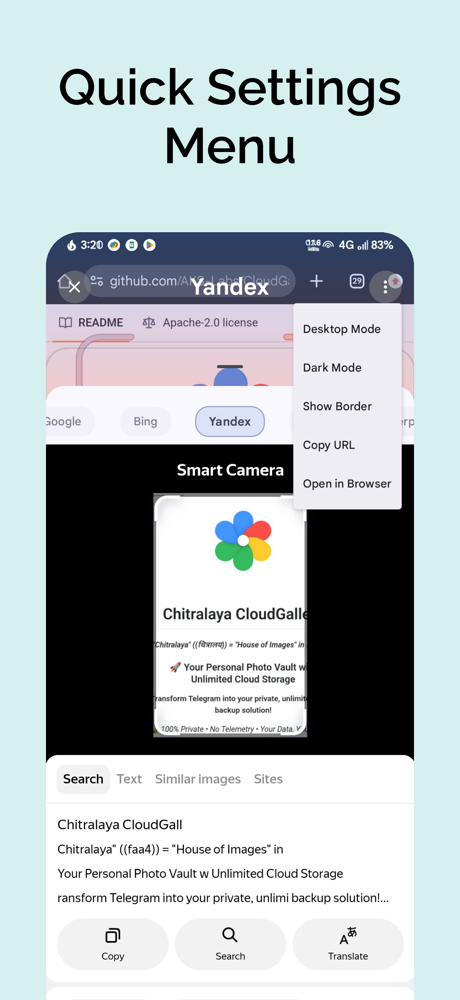
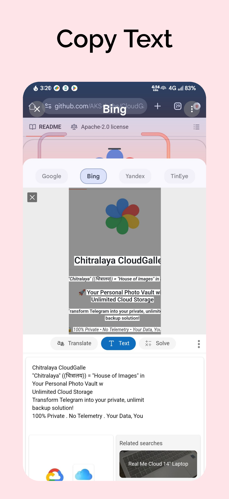
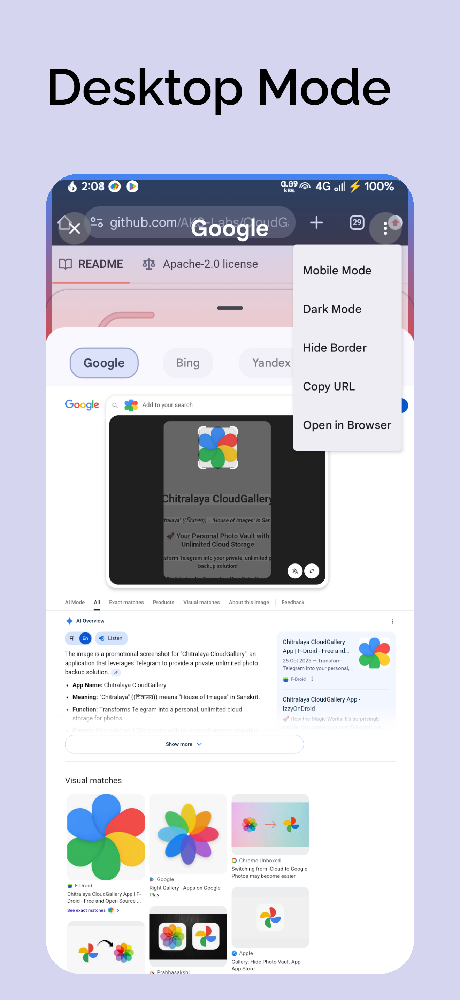

<!-- ---------- Header ---------- -->

  
  <h1>Circle To Search</h1>
  <h3>Circle To Search: Multi-Engine Reverse Image Search</h3>
  
🔒 <em>Google • Bing • Yandex • Tineye</em>

<!-- ---------- Badges ---------- -->
  

    <!--  -->
    <!--  -->
    
    
    <!--  -->
     

    

  
  

  

  

<!-- ----------   Labels ---------- -->

  
  
  
  

---
## 🎯 What is Circle To Search?

Ever wanted to search for something you see on your phone screen? **Circle To Search** brings that power to your fingertips on *any* Android device. Simply draw a circle around what you're looking for, and instantly get results from your favorite search engine.

Think of it as having Google Lens, Bing Visual Search, Yandex, and TinEye all in one place—and it works everywhere.

---
## ✨ Features

-   **Universal Compatibility**: Works on any Android device (Android 10+).
-   **Instant Search**: Double-tap the status bar or use the floating bubble to trigger.
-   **Multi-Engine Support**: Search using Google Lens, Bing, Yandex, TinEye.
-   **Set As Default Assistant**: Use As Default Assistant to Search Images Using Circle To Search.
-   **It Can Talk With Humour**: Show Friendly Playful Message Every Time User Uses Circle To Search.
-   **Desktop Mode**: See Results In Desktop Mode.
-   **Dark Mode**: Browse Search Results in Dark Mode.
-   **Copy Url**: Copy Url Of Search Results.
-   **Open In Browser**: Open Search Results In Favourite Browser.
-   **Smart Selection**: Draw a circle, scribble to select.
-   **Beautiful UI**: Modern Material 3 design with dark mode support and smooth animations.
-   **Customizable**: Toggle dark mode, desktop mode, and UI elements like the gradient border.

---

## 🛠️ Built With

-   **Kotlin** - First-class and official programming language for Android development.
-   **Jetpack Compose** - Android’s modern toolkit for building native UI.
-   **Coroutines** - For asynchronous programming.
-   **Retrofit** - Type-safe HTTP client for Android.
-   **Coil** - Image loading library for Android backed by Kotlin Coroutines.

---

## 📥 **Get Circle To Search**

    <!-- 

   -->
  
   
  
<strong>• 🔓 Open Source    • 🚀 Ready to Use</strong>

---

## 📱 **Screenshots**

<table align="center">
  <tr>
    <td></td>
    <td></td>
    <td></td>
    <td></td>
  </tr>
  <tr>
    <td></td>
    <td></td>
    <td></td>
    <td></td>
  </tr>
</table>

---

## 🤝 **Community**

- 🐛 **Bug reports:** [GitHub Issues](https://github.com/AKS-Labs/CircleToSearch/issues)
- 💡 **Feature requests:** [GitHub Issues](https://github.com/AKS-Labs/CircleToSearch/issues)
- 👨‍💻 **Contribute:** Fork and submit pull requests
- ⭐ Star the repo
* 💬 Join the [AKS-Labs Telegram group](https://t.me/AKSLabs)
* ☕ Maybe [**Donate**](https://github.com/sponsors/AKS-Labs), if you can.

---

## 🙏 Acknowledgments

-   Inspired by Google's Circle to Search feature.
-   Icons by [Material Design Icons](https://fonts.google.com/icons).

---

  Made with ❤️ by <a href="https://github.com/akslabs">AKSLabs</a>

