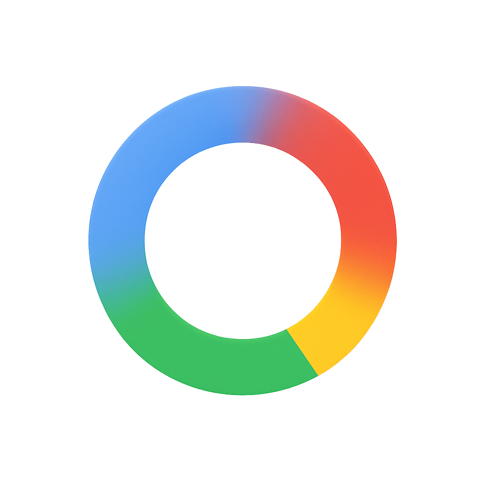
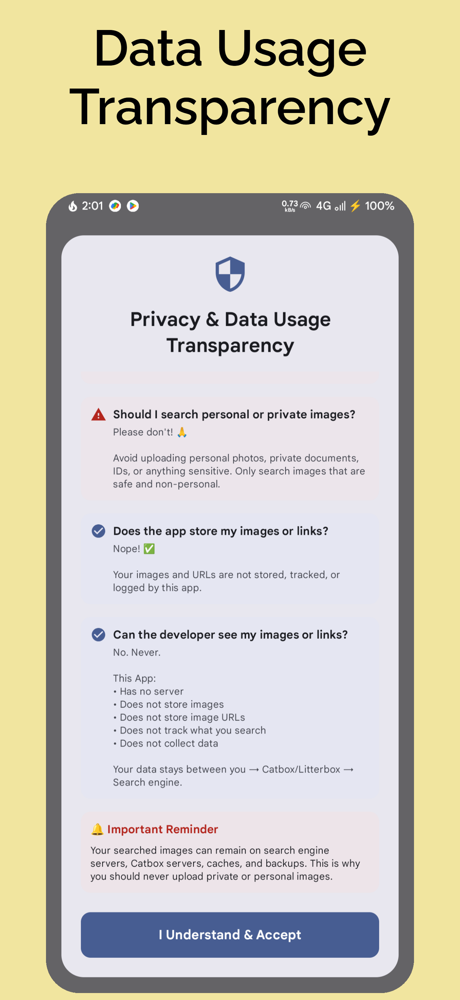
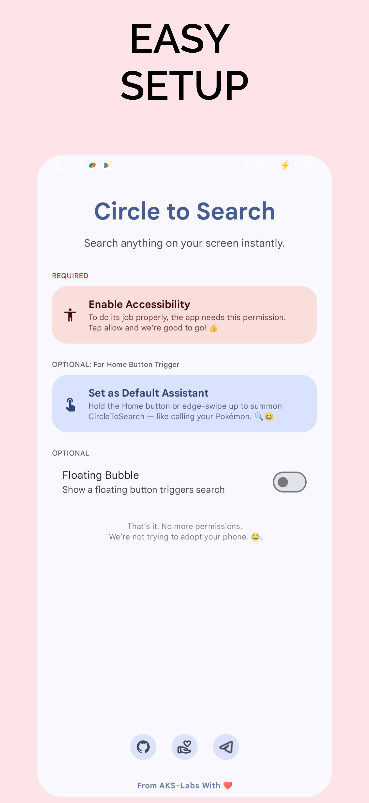
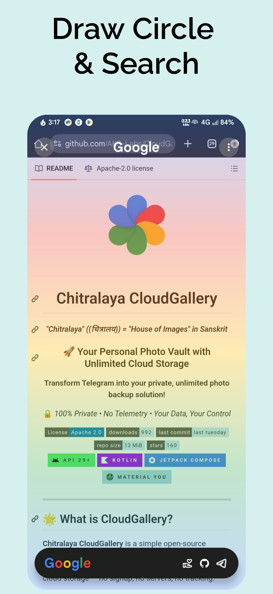
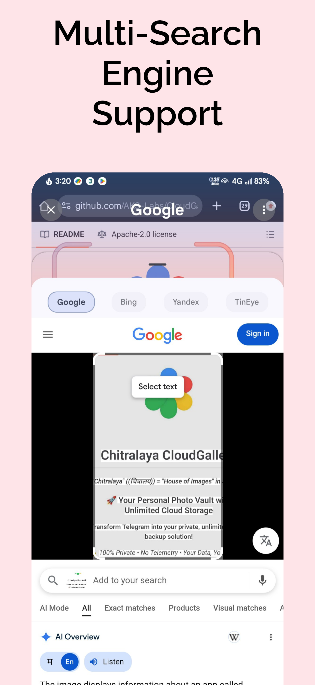

<!-- ---------- Header ---------- -->

  
  <h1>Circle To Search</h1>
  <h3>Multi-Engine Reverse Image Search for Android</h3>
  
🔒 <em>Google • Bing • Yandex • Tineye • Perplexity • ChatGPT</em>

<!-- ---------- Badges ---------- -->
  

    
    
    
    
    
  

---

## ⚖️ License

This project is licensed under the **GNU General Public License v3.0**. 

You are free to use, modify, and distribute this software as long as the same freedoms are preserved for others and proper attribution is given to the original authors. See the [LICENSE](LICENSE) file for the full text.

---

## ⚠️ Attribution & Disclaimer

This project is built upon the open-source work of **[AKS-Labs/CircleToSearch](https://github.com/AKS-Labs/CircleToSearch)**.

> **Note:** This repository is a standalone implementation and is **not forked from or synced with** the original repository. It incorporates significant modifications, optimizations, and new features independently.

---

## 🎯 What is Circle To Search?

**Circle To Search** brings the power of "Circle to Search" to any Android device running Android 10 or newer. Simply trigger the assistant, draw a circle around any object on your screen, and instantly get results from your preferred search engine.

---

## 🚀 Why This Version? (Key Enhancements)

While the original project laid the groundwork, this version has been heavily refactored and optimized to provide a **lighter, faster, and more modern experience**.

### 💎 Exclusive Improvements:

*   **Optimized Build Configuration:**
    *   Updated build configuration with R8 Full Mode, resource shrinking (English-only), and targeted ABI filters (ARM) for a cleaner and more efficient release package.
*   **Next-Gen Android Support:**
    *   Updated to target **Android 16 (API 36)** and Android 15, ensuring compatibility with the latest system behaviors and security features.
*   **Intelligent UI (Contextual Menus):**
    *   Enhanced `TopControlBar` that understands the search context. It automatically hides browser-only features (Desktop Mode, Refresh, Copy URL) when using Google Lens, providing a cleaner and less confusing interface.
*   **Stability & Bug Fixes:**
    *   Fixed critical syntax and compilation errors present in the original codebase that prevented building in environments like AndroidIDE.
    *   Resolved unresolved references and improved the `SearchEngine` polymorphic architecture for rock-solid stability.
*   **CI/CD Ready:**
    *   Includes fully configured GitHub Workflows for automated preview builds and official signed releases.
*   **Privacy-First:**
    *   Stripped out all community-specific bloat, redundant links, and tracking for a pure, open-source experience.

---

## ✨ Key Features

-   **Universal Compatibility:** Works on any Android device (Android 10+).
-   **Multiple Triggers:** Activate via Home Button (Digital Assistant), Quick Settings Tile, or Accessibility Gesture.
-   **Multi-Engine Support:** Choose from Google Lens, Bing, Yandex, TinEye, Perplexity, and ChatGPT.
-   **Smart Selection:** Draw a circle or scribble to select areas of interest.
-   **Desktop Mode:** View search results in desktop layout (for supported engines).
-   **Dark Mode:** Built-in dark mode for comfortable viewing.
-   **Material You:** Modern Material 3 design that adapts to your system theme.

---

## 🛠️ Tech Stack

-   **Kotlin**: 100% Kotlin codebase.
-   **Jetpack Compose**: Modern UI toolkit.
-   **Coroutines**: Asynchronous tasks.
-   **Retrofit & OkHttp**: Networking.
-   **Coil**: Image loading.

---

## 📥 Download

Get the latest optimized APK from the **[Releases Page](../../releases)**.

---

## 📱 Screenshots

<table align="center">
  <tr>
    <td></td>
    <td></td>
    <td></td>
    <td></td>
  </tr>
</table>

---

  Original concept by Google. Base code by <a href="https://github.com/AKS-Labs">AKS-Labs</a>.

